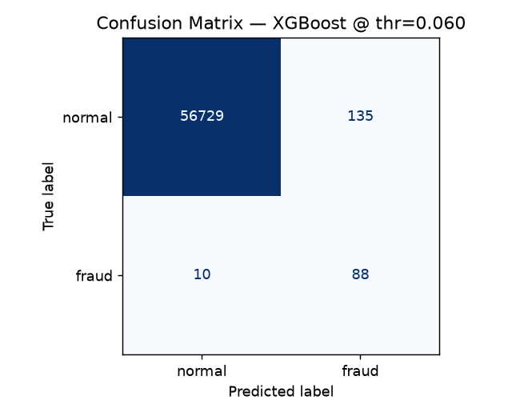
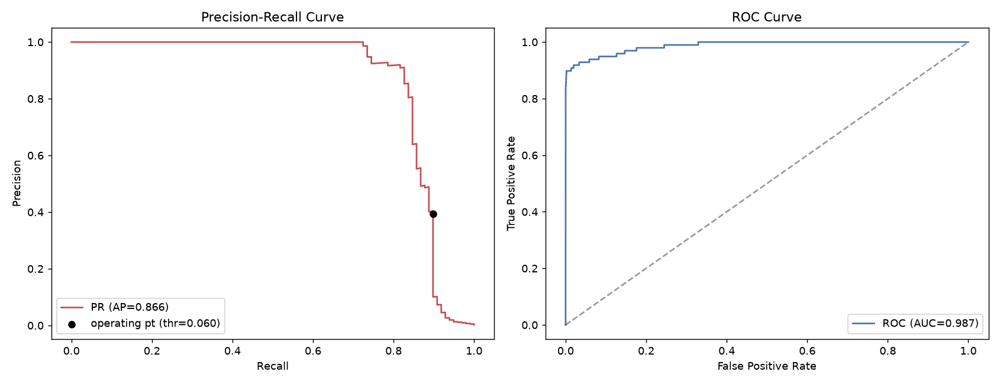
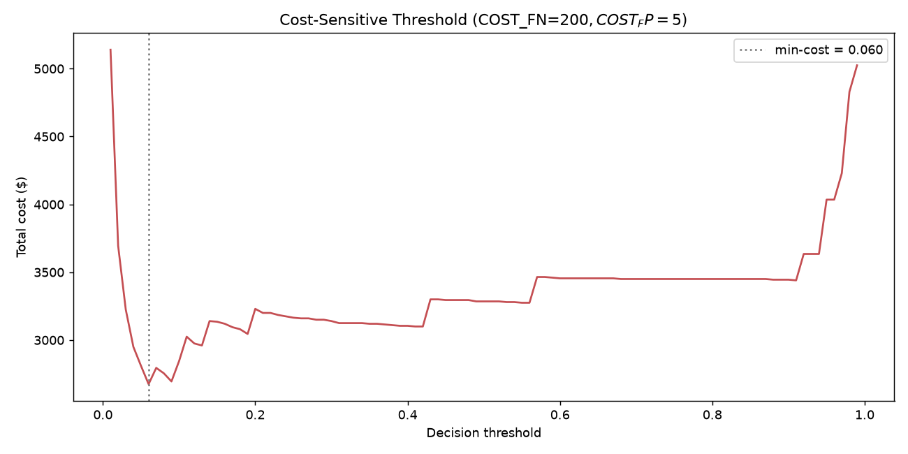
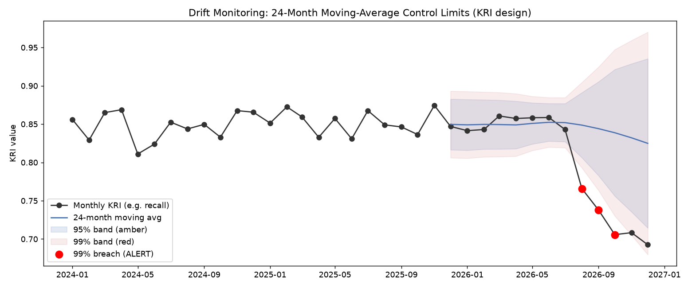

# Fraud Detection with AI Risk Governance Framework

> **An end-to-end fraud detection ML system integrated with enterprise-grade AI governance — featuring a Model Card, EU AI Act mapping, NIST AI RMF application, cost-sensitive thresholding, a fairness audit, and statistical drift monitoring.**

  

---

## 📋 Project Overview

This project demonstrates how a fraud-detection ML model can be developed **and governed** following modern Responsible-AI standards. Beyond predictive performance, the repository builds the governance documentation, drift-monitoring framework, and compliance mapping that production-grade AI systems require — drawing on real-world AI-governance and operational-risk experience in financial services.

**Why this matters:** most fraud-detection portfolios stop at predictive metrics (e.g. ROC-AUC). In practice, AI systems in financial services face stringent regulatory frameworks (EU AI Act, NIST AI RMF) and require ongoing risk monitoring. This project explicitly bridges that gap — treating the model not as a prediction engine, but as a **governed risk asset**.


---

## 📊 Dataset

**Credit Card Fraud Detection** — anonymized European cardholder transactions, September 2013.

| | |
|---|---|
| **Source** | [Kaggle: Credit Card Fraud Detection](https://www.kaggle.com/datasets/mlg-ulb/creditcardfraud) |
| **Size** | 284,807 transactions |
| **Features** | 30 (28 PCA-transformed `V1–V28`, plus `Amount`, `Time`) |
| **Target** | `Class` — 1 = fraud, 0 = normal |
| **Imbalance** | **~0.17%** fraud (492 / 284,807) |

---

## 🏗️ Project Structure

```
fraud-detection-ai-governance/
│
├── notebooks/
│   ├── 01_EDA.ipynb              # Exploratory analysis: imbalance, Amount, Time, correlations
│   ├── 02_Preprocessing.ipynb    # Stratified split + leakage-free scaling
│   ├── 03_Modeling.ipynb         # LogReg → RF → XGBoost; threshold tuning; cost analysis
│   ├── 04_Evaluation.ipynb       # PR/ROC, confusion, fairness audit, error analysis
│   └── 05_AI_Governance.ipynb    # Model card, SHAP, drift, EU AI Act, NIST AI RMF
│
├── src/
│   ├── data_loader.py            # Raw / processed data loading
│   ├── feature_engineering.py    # Stratified split + StandardScaler (leakage-free)
│   ├── models.py                 # Model builders, evaluation, cost-based threshold tuning
│   └── governance_metrics.py     # PSI, 24-month control limits, segment (fairness) report
│
├── docs/                         # ⭐ Core governance documentation
│   ├── MODEL_CARD.md             # Google-style model card
│   ├── AI_RISK_FRAMEWORK.md      # Risk register & treatment plan
│   ├── DRIFT_MONITORING.md       # PSI + KRI control-limit framework
│   ├── EU_AI_ACT_COMPLIANCE.md   # Risk tiering + Articles 9/10/13/14/15 mapping
│   ├── NIST_AI_RMF_MAPPING.md    # Govern / Map / Measure / Manage
│   └── RACI_GOVERNANCE.md        # Lifecycle roles & responsibilities
│
├── results/
│   ├── confusion_matrix.png  pr_curve.png  feature_importance.png
│   ├── cost_curve.png        drift_dashboard.png
│   ├── model_comparison.csv  fairness_by_amount.csv  fairness_by_hour.csv
│   └── decision.json         # Primary model + chosen operating threshold
│
├── data/                         # creditcard.csv + processed/ (git-ignored, regenerable)
├── models/                       # trained .joblib models (git-ignored, regenerable)
├── requirements.txt · LICENSE · README.md
```

> `data/`, `data/processed/`, and `models/` are git-ignored (large / regenerable). Run the notebooks in order to recreate them.

---

## 🔍 Key Findings from EDA

- **Severe imbalance (~0.17% fraud)** drives every downstream choice — sampling, metric (**PR-AUC over ROC-AUC**), threshold tuning, and drift-monitoring design.
- **`Amount` is heavily right-skewed**; fraud sits at a slightly higher mean but overlaps normal — a weak standalone signal needing scaling.
- **`Time` carries time-of-day structure** — relevant for production drift (transaction-hour shifts).
- **PCA features `V14, V17, V12, V10`** correlate most with fraud — later cross-checked against model feature importance for explainability.

---

## 🚀 Methodology

### Phase 1 — Preprocessing ([02](notebooks/02_Preprocessing.ipynb))
- **Split before scaling**, fit the scaler on **train only** → no data leakage.
- Stratified train/test split preserves the 0.17% fraud ratio.
- `StandardScaler` on `Amount` / `Time` (RobustScaler evaluated as an outlier-robust alternative); SMOTE applied to the **training set only**.

### Phase 2 — Modeling ([03](notebooks/03_Modeling.ipynb))
- **Baseline:** Logistic Regression (interpretable, governance-friendly).
- **Candidates:** Random Forest, **XGBoost**.
- **Imbalance:** `class_weight="balanced"`, SMOTE, and `scale_pos_weight` compared.
- **Selection:** PR-AUC + recall at acceptable false-positive cost.

### Phase 3 — Evaluation Beyond Accuracy ([04](notebooks/04_Evaluation.ipynb))
- PR-curve vs ROC-curve; confusion matrix at the operating threshold.
- **Cost-sensitive analysis:** missed fraud (FN) vs blocked legit purchase (FP), with the threshold optimized against a business cost function.
- **Fairness audit:** performance sliced across **Amount ranges** and **time-of-day**.
- **Error analysis:** characterizing the fraud the model misses.

### Phase 4 — AI Governance ⭐ ([05](notebooks/05_AI_Governance.ipynb))
- **[Model Card](docs/MODEL_CARD.md)** in Google Responsible-AI style.
- **SHAP** global + per-decision explanations; **feature-importance vs EDA** cross-check.
- **[Drift Monitoring](docs/DRIFT_MONITORING.md):** PSI + a 24-month rolling baseline with **amber (±1.96σ / 95%)** and **red (±2.576σ / 99%)** control limits.
- **[EU AI Act](docs/EU_AI_ACT_COMPLIANCE.md)** proactive mapping + **[NIST AI RMF](docs/NIST_AI_RMF_MAPPING.md)** application + **[RACI](docs/RACI_GOVERNANCE.md)**.

---

## 📈 Results

**Model comparison** (test set, default 0.5 threshold; sorted by PR-AUC):

| Model | Precision | Recall | F1 | ROC-AUC | **PR-AUC** |
|-------|-----------|--------|----|---------|-----------|
| **XGBoost** | 0.83 | 0.84 | 0.83 | 0.987 | **0.866** |
| Random Forest | 0.92 | 0.79 | 0.85 | 0.957 | 0.863 |
| LogReg + SMOTE | 0.06 | 0.92 | 0.11 | 0.970 | 0.725 |
| LogReg (balanced) | 0.06 | 0.92 | 0.11 | 0.972 | 0.716 |

**Selected model — XGBoost at the cost-optimal threshold (0.06):**

| | |
|---|---|
| Recall | **0.898** (caught **88 / 98** frauds) |
| Precision | 0.395 (135 false alarms) |
| Missed fraud | 10 |

> The threshold is pushed below 0.5 because a missed fraud ($200) is assumed far costlier than a false alarm ($5) — a **business risk-appetite decision**, documented and reviewable, not a technical default.

**⚠️ Fairness finding:** recall is 0.90–1.00 for transactions under $500 but drops to **~0.50 on the $500+ segment** — the highest-value (costliest) frauds are detected least reliably. Logged as an open risk ([AI_RISK_FRAMEWORK.md](docs/AI_RISK_FRAMEWORK.md), R6) with a mitigation before deployment.

| Confusion matrix | PR / ROC curves | Cost vs threshold | Drift dashboard |
|---|---|---|---|
|  |  |  |  |

---

## 💡 AI Risk Analyst Perspective

> The extreme imbalance and distribution patterns surfaced in EDA form the **evidence base** for the governance documentation. The statistical **drift-monitoring framework** — adapted from real-world KRI models in insurance operational risk — establishes how production degradation is detected. The **EU AI Act** and **NIST AI RMF** mappings provide the regulatory alignment needed for deployment in regulated markets.
>
> This three-layer approach — **predictive performance · ongoing risk monitoring · regulatory compliance** — is what distinguishes a production-ready AI asset from a conceptual notebook.

---

## 🛠️ Tech Stack

- **Language:** Python 3.11+
- **ML & Data:** pandas, NumPy, scikit-learn, XGBoost, imbalanced-learn
- **Explainability:** SHAP
- **Visualization:** matplotlib, seaborn
- **Governance docs:** Markdown (versioned in [`/docs`](docs/))

---

## 🏃 Getting Started

```bash
# Clone
git clone https://github.com/Olivia-Yoob/fraud-detection-ai-governance.git
cd fraud-detection-ai-governance

# Environment
python3 -m venv venv
source venv/bin/activate
pip install -r requirements.txt

# Dataset: download from Kaggle and place at data/creditcard.csv
# (not included in repo due to size)

# Run notebooks in order (01 → 05)
jupyter lab notebooks/
```

---

## 🤖 A Note on AI-Assisted Development

This project uses AI coding assistants for code generation, with outputs validated and refactored by the author. This mirrors modern practice — engineering efficiency amplified by AI, while the value lies in **problem definition, output validation, and anchoring the work in a governance framework that domain expertise provides.** The strategic framing — AI risk taxonomy, KRI threshold logic, EU AI Act alignment, and RACI design — draws on the author's professional consulting background.

---

## 📬 Contact

**Olivia Kim (Yoobin Kim)**
- LinkedIn: [linkedin.com/in/enthusiasticyoob1998](https://www.linkedin.com/in/enthusiasticyoob1998/)
- GitHub: [@Olivia-Yoob](https://github.com/Olivia-Yoob)
- Email: yoobink@andrew.cmu.edu

## 📄 License

MIT License — see [LICENSE](LICENSE).

---

**Project Status:** 🚧 Active development (started June 2026) · Target completion: August 2026
